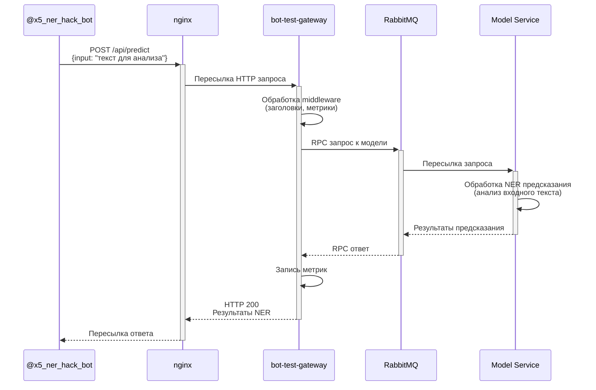
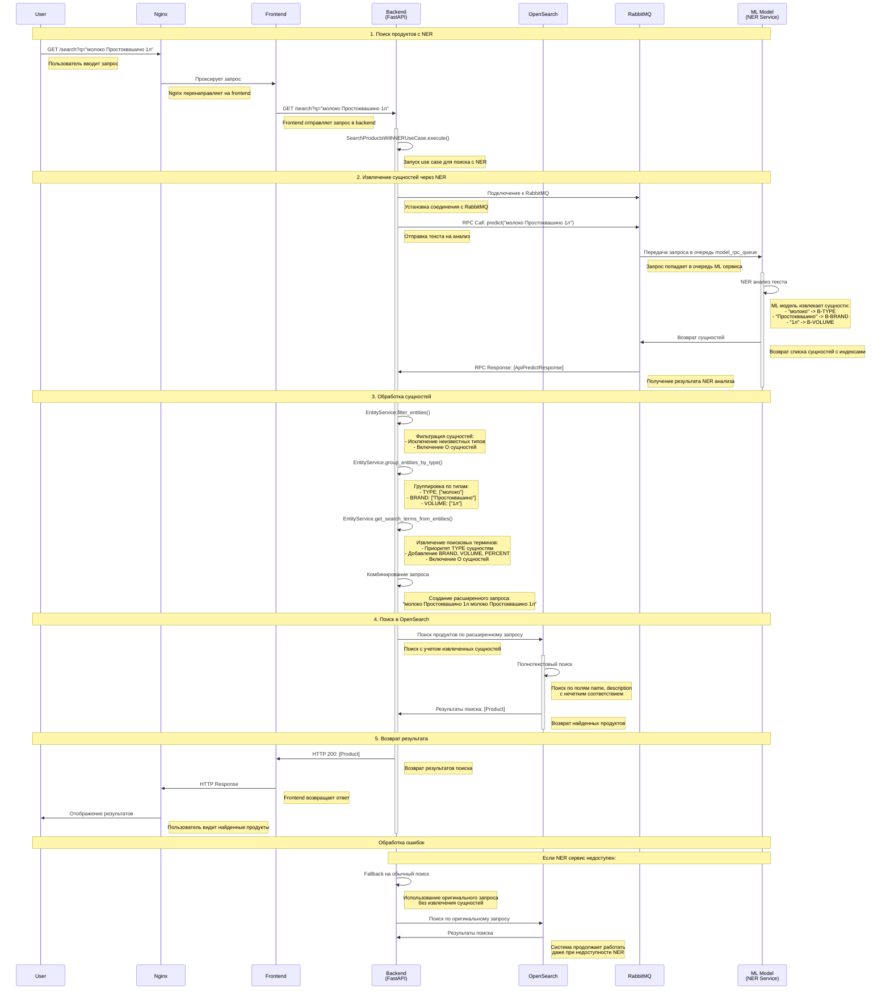

#### Хакатон "Лидеры цифровой трансформации" 2025
---
# Команда "Феличита"
## Бизнес | Задача 10. Сервис выделения сущностей из поискового запроса клиента в мобильном приложении торговой сети “Пятерочка” | X5

[Инструкция для запуска веб-сервиса](https://github.com/hackathon-lct-felicita/model/blob/main/README.md) 

Высоконагруженный веб-сервис, который извлекает сущности из поисковых запросов клиентов торговой сети. Ядро решения — мультиязычная BERT-модель, обогащенная данными OpenFoodFacts и актуального каталога товаров с сайта «Пятёрочки». Уникальность решения — сочетание NER (Named Entity Recognition) с семантическим поиском и привязкой сущностей к реальным товарам из ассортимента сети.

## Bot Test Gateway — Диаграмма последовательности

### Описание процесса

1. **Bot** отправляет POST запрос с текстом для анализа в **nginx**
2. **nginx** пересылает запрос в **bot-test-gateway**
3. **Gateway** обрабатывает middleware (заголовки, метрики)
4. **Gateway** отправляет RPC запрос в **RabbitMQ**
5. **RabbitMQ** пересылает запрос в **Model Service**
6. **Model Service** выполняет NER предсказание
7. Результаты возвращаются обратно через всю цепочку
8. **Gateway** записывает метрики
9. Финальный ответ возвращается в **Bot**

## Алгоритм работы системы поиска продуктов с NER

### Описание диаграммы

Эта диаграмма последовательности показывает алгоритм работы системы поиска продуктов с использованием NER (Named Entity Recognition). Система включает следующие основные этапы:

1. **Поиск продуктов с NER** - пользователь отправляет запрос через Nginx и Frontend
2. **Извлечение сущностей через NER** - Backend использует ML модель для анализа текста запроса
3. **Обработка сущностей** - фильтрация, группировка и создание расширенного поискового запроса
4. **Поиск в OpenSearch** - выполнение полнотекстового поиска с учетом извлеченных сущностей
5. **Возврат результата** - передача найденных продуктов обратно пользователю

Система также включает обработку ошибок с fallback на обычный поиск при недоступности NER сервиса.

